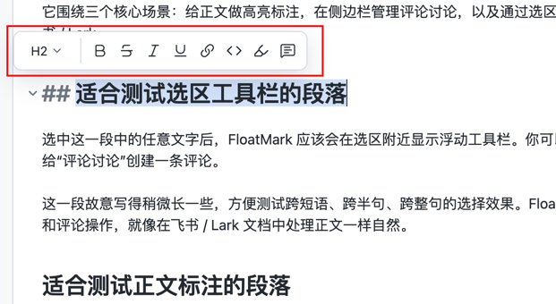
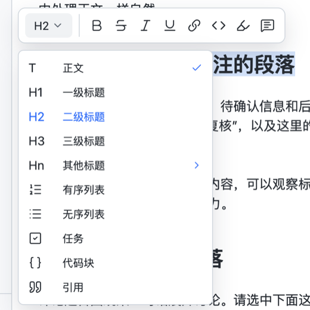
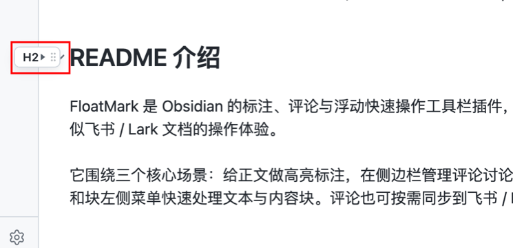
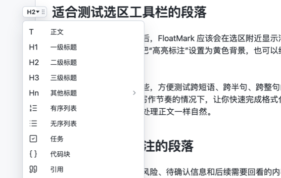

# FloatMark

简体中文 | [English](./README.en.md)

FloatMark 是 Obsidian 的标注、评论与浮动快速操作工具栏插件，在本地笔记中提供类似飞书 / Lark 文档的操作体验。

它围绕三个核心场景：给正文做高亮标注，在侧边栏管理评论讨论，以及通过选区浮窗和块左侧菜单快速处理文本与内容块。评论也可按需同步到飞书 / Lark。

## 功能

- **飞书式选区浮窗**：选中文本后在选区附近显示浮动工具栏，可以快速执行加粗、斜体、删除线、行内代码、高亮和评论等操作。
- **块左侧快捷浮窗**：鼠标移动到段落、标题、列表、引用或代码块等模块左侧时，显示块级快捷入口，可将当前块切换为正文、标题、列表、任务、引用、代码块，也可评论、复制或删除当前块。
- **正文高亮标注**：支持为正文添加高亮标注，可自定义文字色与背景色；高亮标注在编辑模式和阅读模式中都会定位到原文。
- **评论与飞书同步**：侧边栏按当前文档展示评论线程，支持编辑、回复、解决、删除、跳转回正文，并可将本地评论同步为飞书 / Lark 文档评论。
- **本地 sidecar 存储**：评论和视觉标注保存到 `.obsidian-float-marks/`，不会把评论内容直接写进 Markdown 正文。
- **锚点重定位**：当文档内容发生轻微变化时，会尝试通过偏移、上下文和选中文本重新定位标注。

## 使用

### 浮动快速操作工具栏

在编辑模式或阅读模式中选中文本后，FloatMark 会在选区附近显示浮动工具栏，可直接执行加粗、斜体、删除线、行内代码、高亮标注和评论操作。鼠标移动到内容块左侧时，也可以通过块级浮动菜单快速调整块格式。

<table>
  <tr>
    <td width="62%" align="center">
      
    </td>
    <td width="38%" align="center">
      
    </td>
  </tr>
</table>

选中文本后先显示快速操作工具栏；展开格式菜单后，可以继续切换正文、标题、列表、引用等格式。

<table>
  <tr>
    <td width="42%" align="center">
      
    </td>
    <td width="58%" align="center">
      
    </td>
  </tr>
</table>

块级入口保持轻量，展开后才显示完整操作：切换块格式、评论、复制或删除当前块。

### 正文高亮标注

正文高亮标注会直接显示在原文中，适合区分重点、风险、待确认内容和后续需要回看的片段。标注在编辑模式和阅读模式中都会定位到原文。
<p align="center">
  
</p>

创建高亮标注时，可以选择文字色和背景色，让不同类型的信息更容易区分。

<table>
  <tr>
    <td width="68%" align="center">
      
    </td>
    <td width="32%" align="center">
      
    </td>
  </tr>
</table>

多颜色高亮直接显示在正文中；侧边栏可以集中查看当前文档中的高亮标注，并继续调整颜色、备注或定位到原文。

Markdown 格式操作会修改当前笔记正文；评论和视觉标注默认保存到 sidecar JSON，不污染 Markdown 内容。

### 评论与飞书 / Lark 同步

点击左侧栏高亮图标，或使用命令面板打开 FloatMark 侧边栏。侧边栏会展示当前文档的评论线程，支持编辑、回复、解决、删除和跳转回正文。

本地评论可以从侧边栏一键同步到已发布的飞书 / Lark 文档。同步后，评论会显示为飞书 / Lark 文档中的原生评论线程，方便继续在远端协作。

<table>
  <tr>
    <td width="50%" align="center">
      
    </td>
    <td width="50%" align="center">
      
    </td>
  </tr>
</table>

左侧是 Obsidian 中的本地评论线程，右侧是一键同步后出现在飞书 / Lark 文档侧边栏的原生评论。

## 与 Feishu Lark CLI Sync 的关系

FloatMark **不依赖** `obsidian-feishu-lark-cli-sync`，它可以独立作为本地标注和评论插件使用。

只有当你希望把本地评论同步到飞书 / Lark 文档时，才需要配合使用：

- `obsidian-feishu-lark-cli-sync` 负责把 Obsidian Markdown 发布或同步为飞书 / Lark 文档。
- FloatMark 负责本地选区标注、侧边评论，以及把评论同步到已发布文档的对应 block。

同步到飞书 / Lark 需要满足：

- 当前笔记包含 `lark_doc_url` 或 `lark_doc_token`。
- 已存在同步插件生成的 block 映射文件：

```text
.obsidian/plugins/feishu-lark-cli-sync/lark-sync-state.json
```

- 本机已安装并登录 `lark-cli`。

## 使用前准备：飞书 / Lark 同步

如果只使用本地标注和评论，可以跳过本节。

如需同步到飞书 / Lark，请先安装并登录 `lark-cli`：

```bash
npm install -g @larksuite/cli
lark-cli version
lark-cli auth login
lark-cli auth status
```

然后使用 [Feishu Lark CLI Sync](https://github.com/wanghuan9/obsidian-feishu-lark-cli-sync) 发布当前笔记，使笔记获得 `lark_doc_url` 绑定和 block 映射。

## 设置

- `语言`：选择 FloatMark 界面语言；首次没有语言记录时会跟随 Obsidian 当前语言初始化，之后以设置中保存的语言为准。
- `创建标注后打开侧栏`：创建评论或标注后自动打开侧边栏。
- `标注同步飞书`：开启后，添加本地评论或回复会通过 Feishu Lark CLI Sync 同步到飞书 / Lark。
- `Feishu Lark CLI Sync`：展示同步插件状态；飞书 CLI 路径、登录和执行能力由 Feishu Lark CLI Sync 管理。
- `评论显示名称`：本地侧边栏评论线程中的作者显示名。

## 说明

- FloatMark 以本地 Obsidian vault 为主，默认不需要网络服务。
- 本地评论和视觉标注保存在 `.obsidian-float-marks/`，不是 Markdown 正文的一部分。
- 飞书 / Lark 同步通过本机 `lark-cli` 执行，不在插件中保存 App Secret、access token 或 OAuth 配置。
- 远端评论同步是可选能力；没有发布到飞书 / Lark 的笔记仍可正常使用本地标注和评论。

## 安装

### 手动安装

当前可以通过源码构建后手动安装到 Obsidian vault：

```bash
git clone https://github.com/wanghuan9/obsidian-float-mark.git
cd obsidian-float-mark
npm install
npm run build
```

然后将以下文件复制到你的 vault 插件目录，例如 `.obsidian/plugins/float-mark/`：

```text
manifest.json
main.js
styles.css
```

重启 Obsidian 后，在设置 -> 社区插件中启用 `FloatMark`。

## 开发

```bash
npm install
npm run build
npm test
```

修改源码后，需要重新执行 `npm run build` 生成 `main.js`。

## 许可

MIT License
